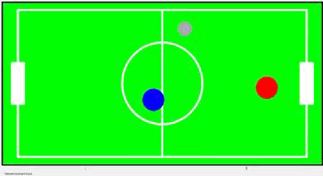
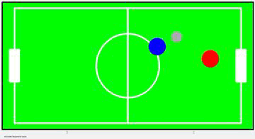
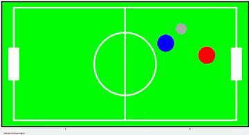
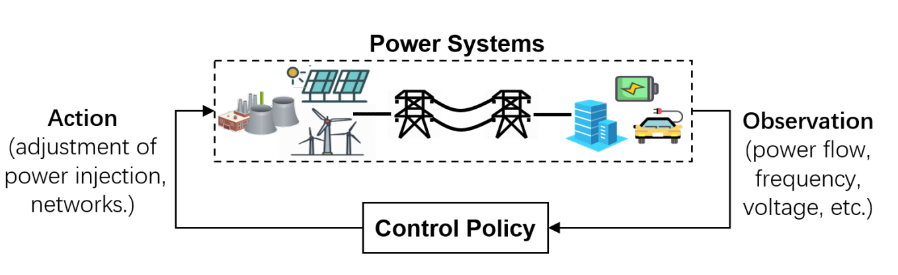

# Reinforcement Learning

In this repository some projects in the context of Reinforcement Learning are presented. These projects include contents of the graduate level courses of the Technical University of Munich. 

## Playing HaxBall
:key: Keywords: Q-Learning, SARSA, Watkins-Q($\lambda$), Eligibility Traces, Tile Coding, N-Steps, Monty Carlo Tree Search

:wrench: C++, Eigen, OpenMP

:x: University Project: Public access to implementation, data or more is not allowed.

#### Environment
A RL agent is trained in a simple simulation environment based on the HaxBall game [[1]](#1). The given HaxBall environment is described as a Markov Decision Process (MDP) with a state space,
an action space and rewards. The goal of the project is to tune various algorithms.

  
   
  

#### Project
Thereby, their characteristics will be tuned using different exploration/exploitation techniques and hyperparameter tuning methods. The book "Reinforcement Learning - An Introduction" [[2]](#2) is used as the baseline for all algorithms.

#### Implemented Algorithms

* Temporal difference learning (SARSA and Q learning)
* Eligibility Traces, e.g. Wakins-Q($\lambda$)
* Monte Carlo reinforcement learning methods
* Linear value function approximation, e.g. tile coding

#### :bookmark_tabs: Sources

<a id="1">[1]</a> HaxBall Game [link](https://www.haxball.com/)

<a id="2">[2]</a> Reinforcement learning: An Introduction, 2nd edition
 [RS Sutton, AG Barto 2018](https://web.stanford.edu/class/psych209/Readings/SuttonBartoIPRLBook2ndEd.pdf)

## Secondary voltage control

:key: Keywords: Secondary voltage control, Soft Actor Critic (SAC), Advantage Actor Critic (A2C), DQN, Neural Combinatorial RL

:wrench: PyTorch, OpenAI Gym, Matlab 

:x: Unpublished Project: Public access to implementation, data or more is not allowed.

:round_pushpin: [National University of Singapore](#https://www.nus.edu.sg/)

#### Project

Moving from rotating to virtual synchronous generators creates the need for stability storage in power grids. Based on previous research it can be seen that instability cannot be ruled out even for high grid inertia values. There is no specification in which location inverter grid forming should be operated. Due to the number of inverters, the continuous variables and varying Ybus (e.g. line switches) a brute force approach via simulation is not possible in real time.

  

#### :bookmark_tabs: Sourcess

<a id="3">[3]</a> Soft Actor-Critic: Off-Policy Maximum Entropy Deep Reinforcement Learning with a Stochastic Actor [Haarnoja et al. 2018](https://arxiv.org/abs/1801.01290)

<a id="4">[4]</a> Soft Actor-Critic for Discrete Action Settings [Petros Christodoulou 2019
](https://arxiv.org/abs/1910.07207)

<a id="5">[5]</a> Asynchronous Methods for Deep Reinforcement Learning [Mnih et al. 2016](https://arxiv.org/abs/1602.01783)